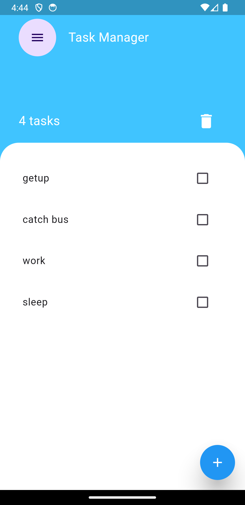
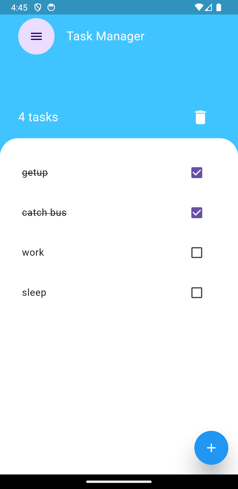
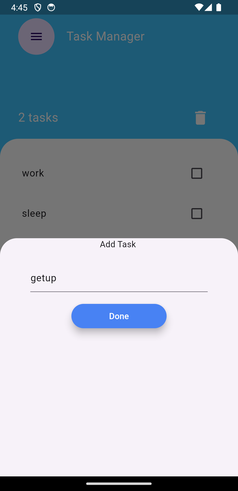

 # The Task Manager
The Task Manager App is a simple and efficient task management application developed using Flutter. It's designed to help you manage your tasks with ease and simplicity. The app utilizes the Provider package for state management and offers a straightforward interface with beautiful graphics.

 # Features
Add Tasks: Easily add new tasks to your task list.
Remove Tasks: Remove completed tasks to keep your list organized.
Task Count: Keep track of the total number of tasks in your list.
Simple and Beautiful Design: The app features an intuitive and aesthetically pleasing user interface.

 # Screenshots
 
 
 
 

 # Dependencies
Flutter: The open-source UI software development toolkit.
Provider: A state management solution for Flutter applications.

Happy task managing!